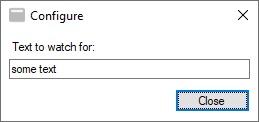
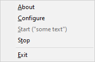
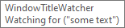

# WindowTitleWatcher
This tiny system tray utility helps get notified when title of an application window changes. `WindowTitleWatcher` makes the application to flash in taskbar when a window with specified text in its title is encountered. 

## Development
.NET 4.8

## Supported platforms
Windows 10/11 

## Usage
Download binaries from [Releases](https://github.com/ilpork/WindowTitleWatcher/releases) and execute the application. It can also be started with command line argument (e.g. `WindowTitleWatcher "Some text"`). If command line argument is given, the watcher is started automatically when starting the application. If no command line argument is given, configuration window is shown.

Watcher stops when text has been found from title of any window, and the window starts to flash in taskbar.

## Licence 
Copyright (c) ilpork. All rights reserved.

Licensed under the MIT license.